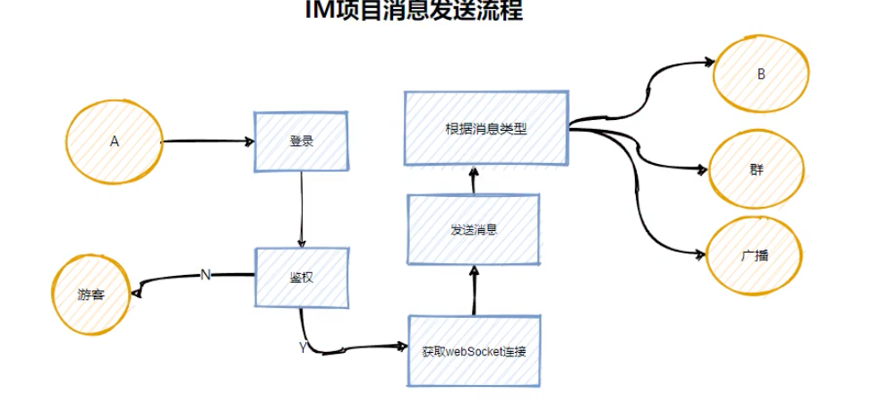

# 需求分析
***
## 项目背景
IM对性能和体验和敏感度非常高
##技术栈
webSocket，channel/goroutine, gin，template,  + GORM + swagger + logrus auth等中间件, sql , nosql, mq
##核心功能
发送和接受消息，文字 表情 图片 音频，访客，点对点，群聊， 广播， 快捷回复，撤回，心跳检测
系统架构

## 环境搭建
###引入gorm
>配置mysql驱动

`go get -u gorm.io/gormgo get -u gorm.io/driver/mysql`
>配置日志打印
```newLogger := logger.New(
log.New(os.Stdout, "\r\n", log.LstdFlags),
logger.Config{
SlowThreshold:             time.Second,
LogLevel:                  logger.Info,
IgnoreRecordNotFoundError: true,
Colorful:                  true,
},
) 
```
### 引入Gin框架
`go get -u github.com/gin-gonic/gin`
> 将数据和请求关联起来 
> 
> 配置请求处理器
> 
> 初始化数据库
### 整合swagger
```
go install github.com/swaggo/swag/cmd/swag
go get -u github.com/swaggo/gin-swagger
go get -u github.com/swaggo/files

docs.SwaggerInfo.BasePath = "/api/v1"
v1 := r.Group("/api/v1")
{
eg := v1.Group("/example")
{
eg.GET("/helloworld",Helloworld)
}
}
r.GET("/swagger/*any", ginSwagger.WrapHandler(swaggerfiles.Handler))
```

### 登录MD5密码校验
### 登录token


